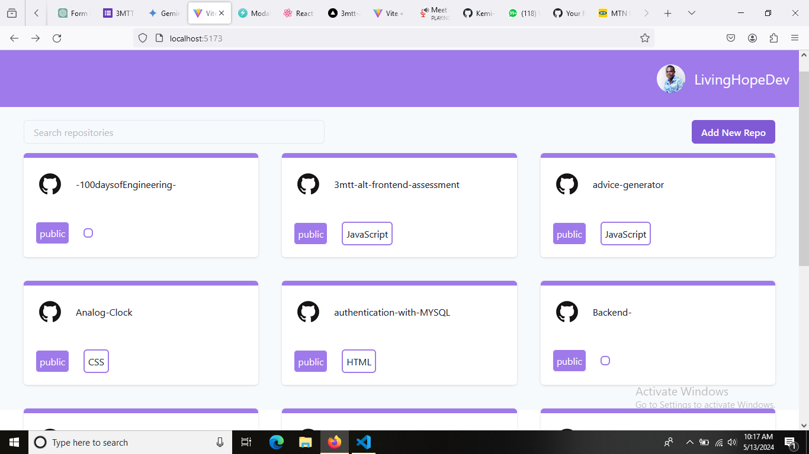
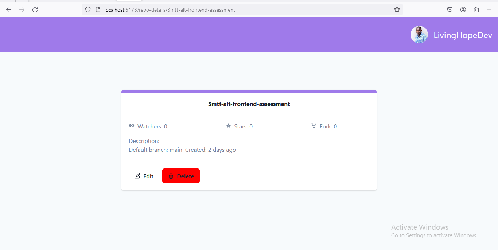
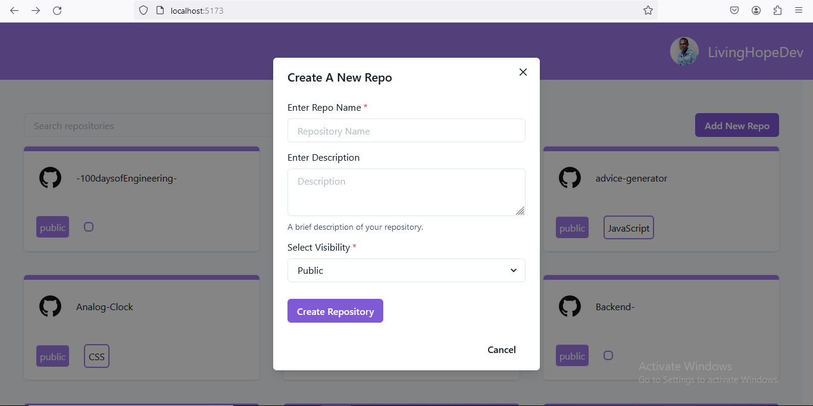
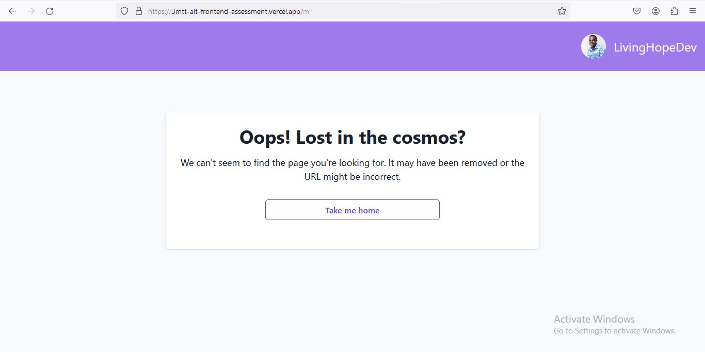
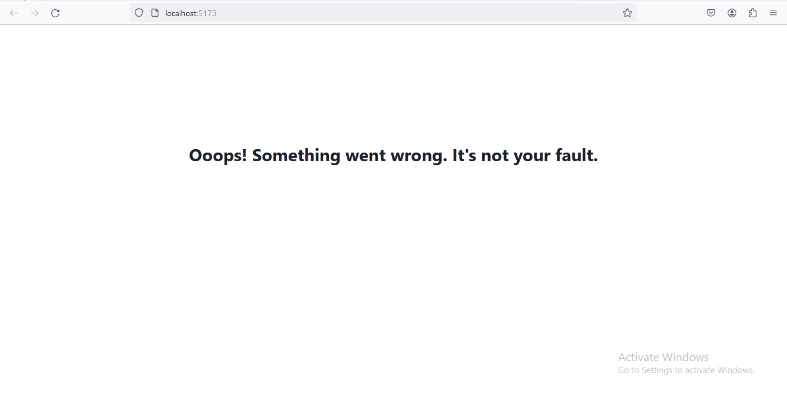

# Overview

This project is a web application designed to serve as a platform for GitHub repository management. Users can view detailed information about repositories, create new ones, and carry out a range of repository-related tasks.

### Features

1.  Dashboard: It shows all available Repositories

2. Repository details: To get the ful details for a particular Repository, click on your desired repo and the full repo would be displayed on a different page.

3.  Create Repo Form. For a new repo to be created, the add new repo button can be clicked to ge the form.
    

4.  404 Page: If a user search of a non-existent page.
    
5.  Errorboundary page: When there is an error in the application which is not neccessarily from the user.
    
